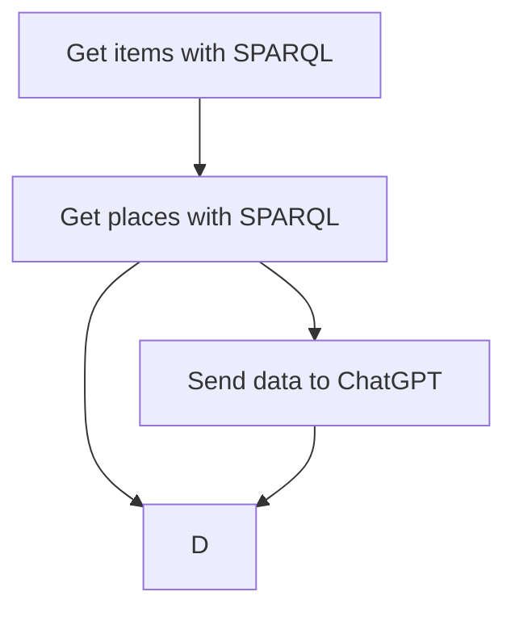

# My page

Here's my code:

```SPARQL
PREFIX arco-location: <https://w3id.org/arco/ontology/location/>
SELECT *
WHERE {
  ?entity rdfs:label ?entityLabel ; 
    arco-location:hasTimeIndexedTypedLocation ?location .
    ?location arco-location:hasLocationType arco-location:StorageLocation .
  }
limit 100
```

*Index*
1. [About me](#about-me)
2. [Bibliography](#bibliography)
3. [RLAST](#really-long-and-stupid-title)

## About me
It's me

## Bibliography
That's da book

## Really long and stupid title
And short content

## Test mermaid



## First test

```SPARQL
PREFIX arco-cd: <https://w3id.org/arco/ontology/context-description/>
PREFIX cis: <http://dati.beniculturali.it/cis/>
SELECT ?collection ?item
WHERE {
 ?collection a cis:CollectionCulEnt.
 ?collection arco-cd:isCollectionIn ?collectionmemb.
 ?collectionmemb arco-cd:hasMemberOfCollection ?item.
} LIMIT 100
```

Results:
[Click here for results](VeryBigTable.md)

Here is the end